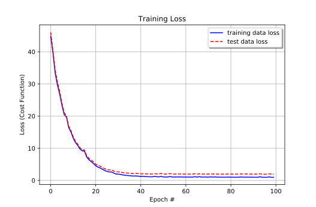
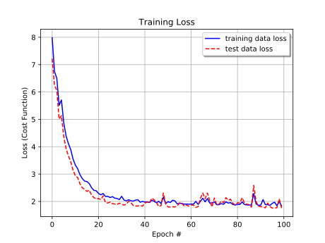
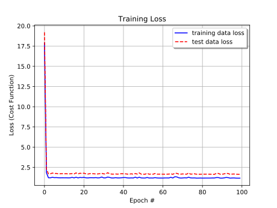
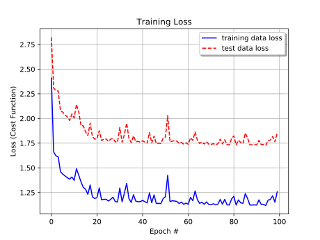

# Linear Regression implementation using TensorFlow

## Overview
This is a basic implementation of multivariable linear regression using Google TensorFlow. The purpose of this project is to introduce myself to TF's data flow graphs and general best practices around python and machine learning.

## Requirements
```bash
Numpy >= 1.14.0
TensorFlow >= 1.4.0
```

## Model description
This implementation leverages the GradientDescentOptimizer method and utilizes the L2 loss function.

## Data
The model was tested using the Wisconsin breast cancer data set from [UC Irvine Machine Learning Repository](http://mlr.cs.umass.edu/ml/index.html) found [here](http://mlr.cs.umass.edu/ml/machine-learning-databases/breast-cancer-wisconsin/). Because this was a learning project the data set was reduced to having the Uniformity of Cell Size and Uniformity of Cell Shape as inputs and Marginal Adhesion as the output.

## File Description
* `data.py` loads data from the files specified (in the `data/` folder).
* `hyperparams.py` includes all hyper parameters.
* `network.py` defines the TensorFlow network.
* `train.py` executes training.
* `utils.py` contains helper and operational functions.

## Hyperparams
* `data_dir = 'data'` -- directory to check for data file
* `learning_rate = 0.01` -- learning rate
* `batch_size = 50` -- training batch size
* `epochs = 100` -- number of training epochs
* `validation_size = 0.4` -- percentage of the data set to be used for validation against over-fitting

## Training
Training is done by breaking the data set into training and testing data set in order to help evaluate over-fitting. The training is then conducted over several epochs to produce the results.

The second and third columns are extracted from the data file for inputs and the forth column for outputs. If a different data set is used or if different features are desired configure the below code in the `train.py` file.
```bash
input_data = [[int(row[1]), int(row[2])] for row in data]
output_data = [[int(row[3])] for row in data]
```

## Results
As the purpose of this implementation is purely educational, curacy of the final model is less relevant then the demonstration of increasing accuracy as a result of training. 

The results were found to vary drastically depending on the initialized variable weights and on the ratio of outliers falling into the testing data set. 

Below are the results after 4 separate training sessions using the hyperparams listed in the above section.

#### Training Session #1

Training curve for the train and test data set 


Cost output every 20 epoches:
```
Epoch #20 of 100
Training data loss:  5.2501764
Testing data loss:  5.768419
Epoch #40 of 100
Training data loss:  1.3231934
Testing data loss:  2.1439059
Epoch #60 of 100
Training data loss:  1.0469899
Testing data loss:  1.9773421
Epoch #80 of 100
Training data loss:  1.0359195
Testing data loss:  1.9992003
Epoch #100 of 100
Training data loss:  0.9801721
Testing data loss:  1.9470495
```

#### Training Session #2

Training curve for the train and test data set 


Cost output every 20 epoches:
```
Epoch #20 of 100
Training data loss:  2.3909023
Testing data loss:  2.091456
Epoch #40 of 100
Training data loss:  1.9967732
Testing data loss:  1.8257731
Epoch #60 of 100
Training data loss:  1.8974432
Testing data loss:  1.8254952
Epoch #80 of 100
Training data loss:  1.8695335
Testing data loss:  1.8698949
Epoch #100 of 100
Training data loss:  1.8401098
Testing data loss:  1.7564405
```

#### Training Session #3

Training curve for the train and test data set 


Cost output every 20 epoches:
```
Epoch #20 of 100
Training data loss:  1.2353559
Testing data loss:  1.7400932
Epoch #40 of 100
Training data loss:  1.2174197
Testing data loss:  1.72011
Epoch #60 of 100
Training data loss:  1.1838093
Testing data loss:  1.6705498
Epoch #80 of 100
Training data loss:  1.1843609
Testing data loss:  1.6523916
Epoch #100 of 100
Training data loss:  1.1707969
Testing data loss:  1.6346318
```


#### Training Session #4

Training curve for the train and test data set 


Cost output every 20 epoches:
```
Epoch #20 of 100
Training data loss:  1.1897182
Testing data loss:  1.7914276
Epoch #40 of 100
Training data loss:  1.1576228
Testing data loss:  1.760252
Epoch #60 of 100
Training data loss:  1.1422443
Testing data loss:  1.7531451
Epoch #80 of 100
Training data loss:  1.1848794
Testing data loss:  1.7965821
Epoch #100 of 100
Training data loss:  1.2569741
Testing data loss:  1.8566751
```
